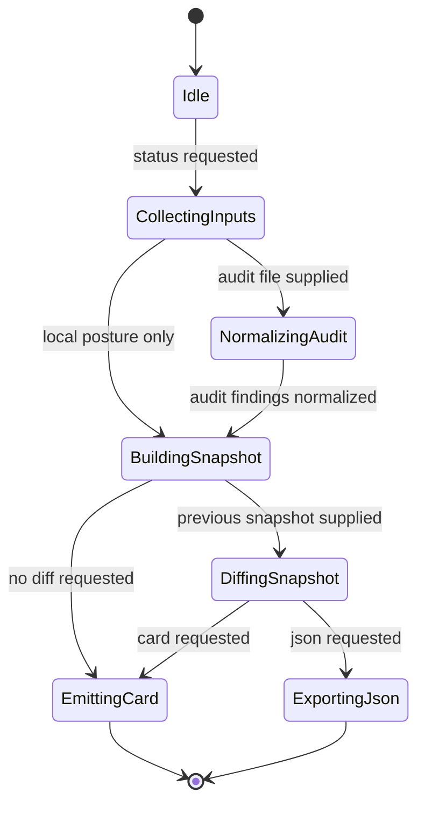
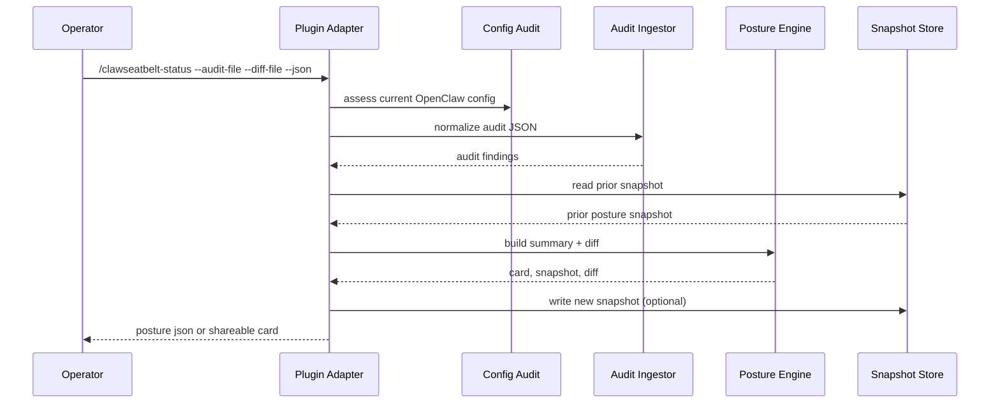
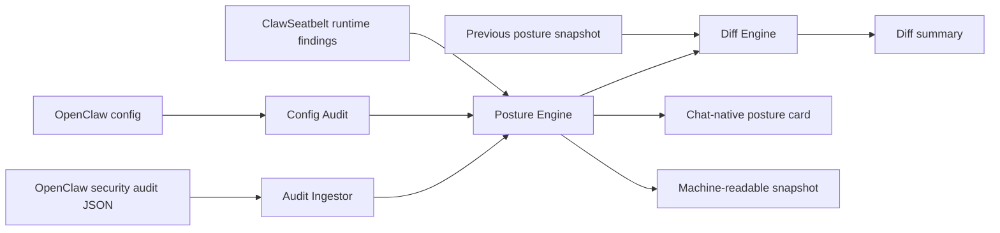

# Posture Engine

The posture engine is where ClawSeatbelt turns scattered signals into one operator decision surface. It ingests ClawSeatbelt findings, normalized OpenClaw security audit JSON, and current configuration posture, then emits three things:

- a chat-native posture card
- a machine-readable snapshot
- a diff against a prior snapshot

## State Machine

## Sequence

## Data Flow

## Design Notes

- The hot path stays local and cheap. Audit ingestion and diffing happen only on demand.
- Imported OpenClaw audit findings are normalized into ClawSeatbelt findings so one remediation model can drive the output.
- Snapshot format is versioned so later releases can evolve the structure without silent breakage.
